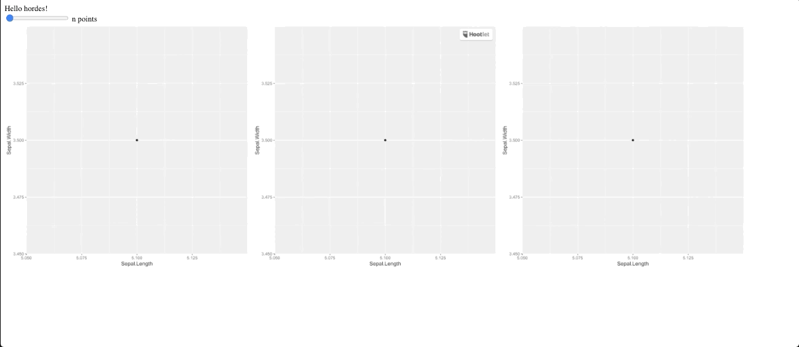

# Building a Web App

## Example 

### Using HTTP request (slower)

+ Front end 

```html 
<!DOCTYPE html>
<html>
   <head>
      <meta http-equiv="Content-Type" content="text/html; charset=UTF-8">
      <title>Test</title>
   </head>
<body>
    <div> Hello hordes! </div>
    <div>
      <div>
        <input type="range" id="volume" name="npoint" min="0" max="150" onchange="change(this.value)">
        <label for="npoint">n points</label>
      </div>
      
      
      
    </div>
    <script type="text/javascript">
        function change(value){
          document.getElementById("plot").src = `/ggplot?n=${value}`
          document.getElementById("plot2").src = `/ggplot?n=${value}`
          document.getElementById("plot3").src = `/ggplot?n=${value}`
        }
    </script>
</body></html>
```

+ Backend 

```javascript
const express = require('express');
const {library} = require('hordes');
const app = express();
const hordesx = library("hordesx")

app.get('/ggplot', async (req, res) => {
    try {
        const im = await hordesx.ggpoint(`n = ${req.query.n}`);
        const img = Buffer.from(im, 'base64');
        res.writeHead(200, {
          'Content-Type': 'image/png',
          'Content-Length': img.length
        });
      res.end(img); 
    } catch(e){
        res.status(500).send(e)
    }
})

app.get('/test', function(req, res) {
    res.sendFile('test.html', {root: __dirname })
});

app.listen(2811, function () {
  console.log('Example app listening on port 2811!')
})
```

+ R Function

```r
#' ggpoint
#'
#' @export
#' @import ggplot2
ggpoint <- function(n) {
  gg <- ggplot(iris[1:n, ], aes(Sepal.Length, Sepal.Width)) +
    geom_point()
  hordes::base64_img_ggplot(gg)
}
```


### Using a Websocket 

+ Front End 

```html
<!DOCTYPE html>
<html>
   <head>
      <meta http-equiv="Content-Type" content="text/html; charset=UTF-8">
      <script src="https://code.jquery.com/jquery-3.4.1.min.js"></script>
      <title>Test</title>
   </head>
<body>
    <div> Hello hordes! </div>
    <div>
      <div>
        <input type="range" id="volume" name="npoint" min="0" max="150" onchange="update(this.value)">
        <label for="npoint">n points</label>
      </div>
      
      
      
    </div>
    <script src="/socket.io/socket.io.js"></script>
    <script>
      var socket = io();
      
      $(function () {
        var socket = io();
        socket.on('plotbck', function(base64){
          document.getElementById("plot").src = `data:image/png;base64, ${base64}`
          document.getElementById("plot2").src = `data:image/png;base64, ${base64}`
          document.getElementById("plot3").src = `data:image/png;base64, ${base64}`
        });
      });
      
      function update(value){
        socket.emit('plot', value);
        return false;
      }
    </script>
    <script type="text/javascript">
    </script>
</body></html>
```

+ Backend 

```javascript
const express = require('express');
const {library} = require('hordes');
const app = express();

const http = require('http').createServer(app);
const io = require('socket.io')(http);

const hordesx = library("hordesx");

app.get('/test', function(req, res) {
    res.sendFile('test.html', {root: __dirname })
});

io.on('connection', async (socket) => {
  
  // Render the first image
  const image = await hordesx.ggpoint('n = 50');
  io.emit('plotbck', image);
  
  // Render plot on change
  socket.on('plot', async(value) => {
    const image = await hordesx.ggpoint(`n = ${value}`);
    io.emit('plotbck', image);
  });
  
});

http.listen(2811, function () {
  console.log('Example app listening on port 2811!')
})
```

+ R Function

```r
#' ggpoint
#'
#' @export
#' @import ggplot2
ggpoint <- function(n) {
  gg <- ggplot(iris[1:n, ], aes(Sepal.Length, Sepal.Width)) +
    geom_point()
  hordes::base64_img_ggplot(gg)
}
```

